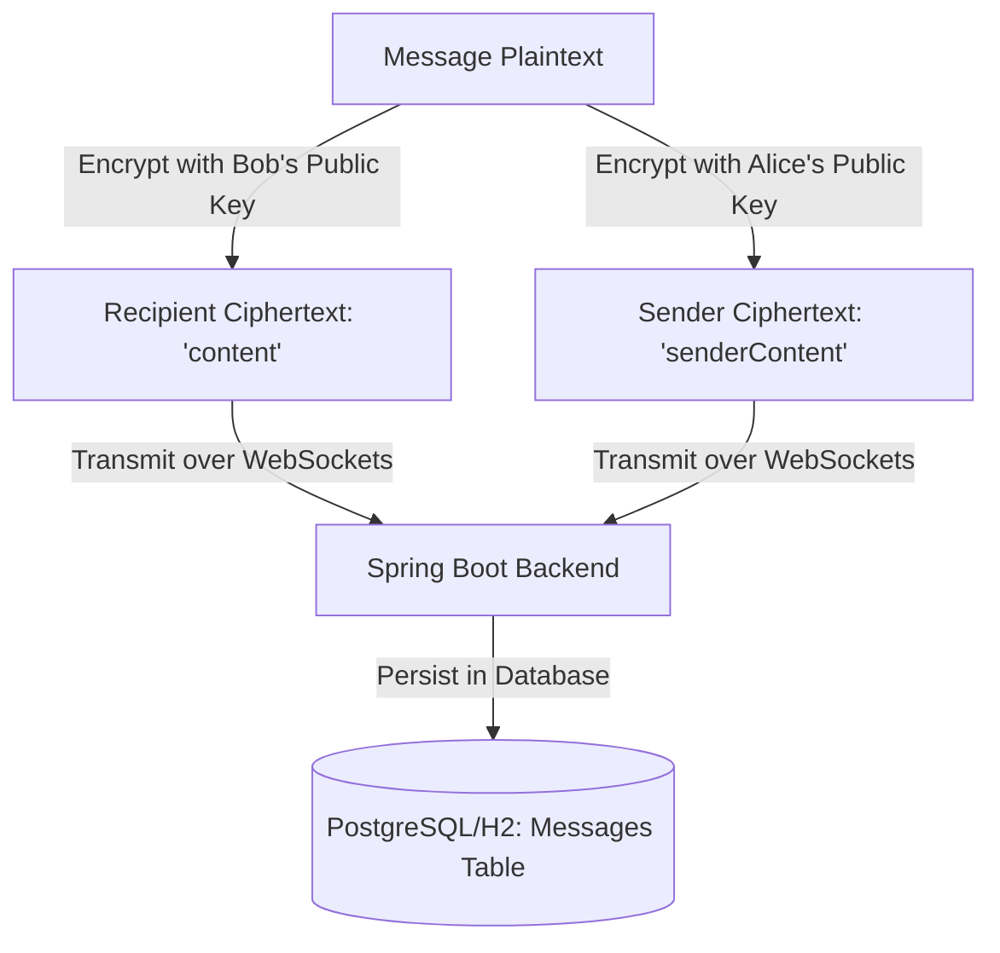
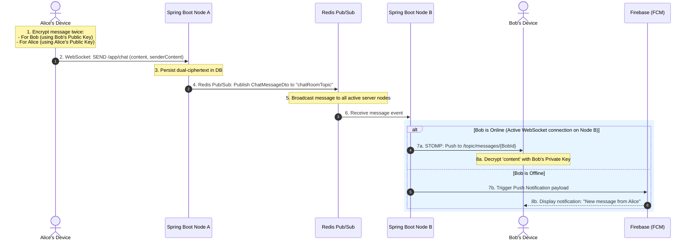

# ChatAppV2: End-to-End Encrypted Real-Time Messaging Platform

An enterprise-grade, secure, real-time messaging system featuring **End-to-End Encryption (E2EE)**, asymmetric cryptographic key exchanges, and real-time message broadcasting. The platform is architected with a decoupled **Android Native Client** and a robust **Spring Boot Java Backend**, utilizing **WebSockets with STOMP** and **Redis Pub/Sub** for multi-instance scalability.

---

## 1. System Architecture Overview

The system follows a classic **Client-Server Architecture**, but with a modern, secure, and decentralized cryptographic foundation:

```mermaid
graph TD
    subgraph Client Device (Android)
        A[Android App Client] <--> |Local Storage| B[(SharedPreferences: CryptoPrefs.xml)]
        A <--> |Crypto Engine| C[CryptoManager.java]
    end

    subgraph Transport Layer (Secure Channels)
        A <--> |HTTPS REST API / JSON| D[Spring Boot Backend]
        A <--> |WSS STOMP over WebSockets| D
    end

    subgraph Backend Services & Storage
        D <--> |Pub/Sub Messaging Bridge| E[(Redis Cache / Broker)]
        D <--> |JPA Persistence| F[(Relational Database)]
    end
```

### Components
1. **Android Client (`ChatApp`)**: A native Android mobile app utilizing Java, Retrofit for RESTful APIs, and a custom STOMP client for real-time WebSocket communication.
2. **Spring Boot Backend (`realtime-chat-backend`)**: A secure Spring Boot application exposing REST services, a WebSocket message broker (STOMP), and integrating Redis for event publishing and persistence.

---

## 2. End-to-End Encryption (E2EE) Deep Dive

The core security principle of **ChatAppV2** is that **messages are encrypted before they leave the sender's device and can only be decrypted by the intended recipient (or the sender themselves for history visualization)**. The backend server functions as a "blind" transport mediator, possessing no technical means to decrypt the payloads it persists.

### A. The Asymmetric Cryptographic Choice: RSA-2048
The application implements **RSA (Rivest–Shamir–Adleman) 2048-bit asymmetric encryption** combined with `RSA/ECB/PKCS1Padding` transformation. 

* **Why RSA?** Asymmetric cryptography allows secure transmission of secret information without requiring a pre-shared secret key.
* **Why 2048-bit?** It balances strong, production-grade security (deemed computationally secure against brute force for the foreseeable future) with rapid mobile processing speeds.
* **Why PKCS1Padding?** Prevents deterministic encryption attacks. Every encryption of the exact same plaintext produces a completely different ciphertext, protecting against patterns analysis.

### B. On-Device Key Generation & Secure Storage
Keys are generated directly on the mobile device during initial app setup within `CryptoManager.java`:

```java
KeyPairGenerator kpg = KeyPairGenerator.getInstance("RSA");
kpg.initialize(2048);
KeyPair kp = kpg.generateKeyPair();
PublicKey publicKey = kp.getPublic();
PrivateKey privateKey = kp.getPrivate();
```

* **Storage Location (Zero-Knowledge)**: 
  * The **Private Key** is serialized via Base64 (using `PKCS8EncodedKeySpec`) and stored locally in the application's private **`SharedPreferences`** (`CryptoPrefs.xml`).
  * **Crucial Rule**: The Private Key **never** leaves the physical device. It is never transmitted across the network or stored in any backend database.
  * The **Public Key** is serialized (using `X509EncodedKeySpec`) and uploaded to the server to establish friendships.

### C. The Friendship Public Key Exchange Protocol
For User A to message User B securely, User A must possess User B's public key. This is accomplished through an out-of-band **Public Key Directory Service** integrated directly into the friend request flow:

```mermaid
sequenceDiagram
    autonumber
    actor Alice as Alice (User A)
    participant Server as Spring Boot Server
    actor Bob as Bob (User B)

    Alice->>Server: 1. Send Friend Request (Alice's Public Key Attached)
    Note over Server: Server stores Alice's Public Key in FriendRequest (PENDING)
    Server-->>Bob: 2. Deliver Pending Request Notification
    Bob->>Server: 3. Accept Friend Request (Bob's Public Key Attached)
    Note over Server: Server stores Bob's Public Key; updates relation to ACCEPTED
    Alice->>Server: 4. Request Friend List (with Bob's public key)
    Server-->>Alice: Returns Friend List containing Bob's Public Key
    Bob->>Server: 5. Request Friend List (with Alice's public key)
    Server-->>Bob: Returns Friend List containing Alice's Public Key
```

Through this secure handshake:
* **`FriendRequest.java`** acts as the cryptographic registry, maintaining the public keys of the sender and recipient securely in columns `sender_public_key` and `recipient_public_key`.

### D. The Zero-Knowledge Dual Ciphertext Technique
When a user encrypts a message, the system faces an architectural challenge: *If only the recipient can decrypt the message, how can the sender view their own message history on a clean install or when retrieving messages from the server database?*

ChatAppV2 resolves this using a **Dual Ciphertext storage strategy**:



#### The Sending Process (`ChatActivity.java`):
1. **Encrypt for Recipient**: The plaintext is encrypted using the recipient's public key and set as `content`.
2. **Encrypt for Sender**: The same plaintext is encrypted using the sender's own public key and set as `senderContent`.
3. **Payload Construction**: The payload containing both encrypted texts is sent to the server.

```java
String encryptedForRecipient = cryptoManager.encrypt(plaintext, recipientPublicKey);
String encryptedForSender = cryptoManager.encrypt(plaintext, cryptoManager.getPublicKeyBase64());

ChatMessage message = new ChatMessage();
message.setContent(encryptedForRecipient);    // Bob will decrypt this
message.setSenderContent(encryptedForSender);  // Alice will decrypt this
```

#### The Retrieval Process (`ChatActivity.java`):
When fetching chat history:
* If the message was **sent by the current user**, they decrypt `senderContent` using their own Private Key.
* If the message was **received by the current user**, they decrypt `content` using their own Private Key.

```java
if (msg.getSenderId().equals(currentUserId)) {
    // Decrypt the sender's copy using my own private key
    String decrypted = cryptoManager.decrypt(msg.getSenderContent());
    msg.setContent(decrypted);
} else {
    // Decrypt the recipient's copy using my own private key
    String decrypted = cryptoManager.decrypt(msg.getContent());
    msg.setContent(decrypted);
}
```
**Security Outcome**: The server stores only the two ciphertexts. Since the server does not have Alice's or Bob's private keys, the messages remain **100% confidential**.

### E. Key Storage Formats & Code Variables Mapping (Understanding Logs & Code)
When examining the database rows, network payloads, or Android `logcat` outputs, the keys appear in different formats depending on whether they are stored, transmitted, or actively computed in math operations:

#### 1. Serialization & Storage Formats
* **Private Key (Client Device Only)**:
  * **Location**: Android private sandboxed SharedPreferences (`CryptoPrefs.xml`). **Never sent to the server.**
  * **Format**: Serialized as a binary **PKCS#8 encoded byte array**, then represented as a standard **Base64 String** without line wraps (`Base64.NO_WRAP`).
  * **PKCS#8 Notation Example**: Serializes the private key elements $(n, d, p, q, dP, dQ, qInv)$ into a single variable using ASN.1:
    $$\text{RSAPrivateKey} \Rightarrow \text{SEQUENCE} \{ \text{version}, n, e, d, p, q, dP, dQ, qInv \}$$
    This binary tree is DER-encoded and wrapped into a single base64 string.
* **Public Key (Database & Exchange payload)**:
  * **Location**: Relational Database (`friend_requests` table, columns `sender_public_key` and `recipient_public_key`).
  * **Format**: Serialized as a binary **X.509 encoded byte array**, then represented as a standard **Base64 String** (e.g. starting with `MIIBIjANBgkqhkiG9w0B...`).
  * **X.509 Notation Example (Packaging $(n, e)$ into a single variable)**:
    An RSA public key mathematically consists of two components: Modulus $n$ and Public Exponent $e$, represented as $(n, e)$. To store them in a single database string variable (e.g., `recipientPublicKey`), the app packages them using the standard **X.509 SubjectPublicKeyInfo** ASN.1 sequence:
    1. First, the key parameters $(n, e)$ are formatted into an inner sequence:
       $$\text{RSAPublicKey} \Rightarrow \text{SEQUENCE} \{ n \text{ (INTEGER)}, e \text{ (INTEGER)} \}$$
    2. Next, this inner block is wrapped with the algorithm identifier ($1.2.840.113549.1.1.1$ for RSA):
       $$\text{SubjectPublicKeyInfo} \Rightarrow \text{SEQUENCE} \{ \text{algorithm (AlgorithmIdentifier)}, \text{subjectPublicKey (BIT STRING wraps RSAPublicKey)} \}$$
    3. The complete abstract tree is compiled into a single contiguous binary byte array using **DER (Distinguished Encoding Rules)**.
    4. Finally, the binary bytes are Base64-encoded to yield a single, portable string variable stored in the DB:
       $$\text{Public Key String} = \text{Base64}(\text{DER}(\text{SubjectPublicKeyInfo}(n, e)))$$

#### 2. Runtime Mathematical Representations (Why Logs Show "Just Numbers")
At runtime inside `CryptoManager.java`, Base64 strings cannot be mathematically computed. The keys are dynamically cast to Java **`BigInteger`** objects to calculate raw modular arithmetic (e.g. $M^e \pmod n$). 

When Java prints a `BigInteger` using string concatenation in logs, it automatically prints the **raw base-10 decimal integer sequence** rather than a Base64 string. The table below maps the code variables to their cryptographic roles:

| Code Variable | Cryptographic / Math Role | Description | Stored In |
| :--- | :--- | :--- | :--- |
| **`privateKey`** / **`rsaOwnPrivateKey`** | Private Key ($Key_{private}$) | The client's local private credential object. | Local `CryptoPrefs.xml` |
| **`dOwn`** | **Private Exponent ($d$)** | The secret exponent used to sign or decrypt data. | Local `CryptoPrefs.xml` |
| **`nOwn`** / **`nSender`** / **`nRecipient`** | **Modulus ($n$)** | The giant RSA base number ($p \times q$) shared by both public and private keys. | Shared/DB |
| **`recipientKey`** / **`rsaRecipientKey`** | Recipient's Public Key | The public key object of the person you are sending a message to. | DB (`friend_requests`) |
| **`eRecipient`** / **`eSender`** | **Public Exponent ($e$)** | The encryption exponent (standard RSA value `65537`). | Shared |
| **`senderKey`** / **`rsaSenderKey`** | Sender's Public Key | The public key object of the person who sent the message you are decrypting. | DB (`friend_requests`) |
| **`M`** | Message Plaintext ($M$) | The decimal representation of your plaintext string. | Temporary Memory |
| **`C`** | Ciphertext ($C$) | The raw decimal representation of the modular math output before Base64 serialization. | DB (as Base64 String) |

---

## 3. How the App Works: End-to-End Application Workflows

To understand how **ChatAppV2** functions at runtime, we can break down its operation into five distinct, sequential phases that span the Android Native client, the Spring Boot servers, the DB, and the Redis cache.

### Phase 1: User Onboarding & Cryptographic Key Generation
When a new user installs the app and completes registration/login:
1. **Key Generation Trigger**: During initial setup, the Android client checks if a cryptographic key pair exists locally in `CryptoPrefs.xml`.
2. **On-Device Generation**: If none exists, `CryptoManager.java` uses `KeyPairGenerator` to generate an **RSA 2048-bit key pair** locally.
3. **Private Key Storage**: The private key is encoded in Base64 (using `PKCS8EncodedKeySpec`) and saved directly into the private, sandbox-isolated **`SharedPreferences`** (`CryptoPrefs.xml`). **It never leaves the device.**
4. **Public Key Upload**: The client extracts the public key, encodes it in Base64 (using `X509EncodedKeySpec`), and registers the user profile on the Spring Boot backend (`/api/auth/register`).

---

### Phase 2: User Discovery & Cryptographic Friendship Handshake (Public Key Exchange)
Before User A (Alice) can send an E2EE message to User B (Bob), Alice must obtain Bob's public key. The application manages this using a secure public key exchange integrated directly into the friendship request workflow:

1. **User Search**: Alice searches for Bob's username in `SearchUsersActivity.java`. The request queries `/api/friends/search` on the backend, returning Bob's basic profile (excluding his public key to minimize exposure).
2. **Initiating Friend Request**: Alice taps "Add Friend". Her device sends a POST request to `/api/friends/request` containing **Alice's Public Key** in the payload.
3. **Pending Persistence**: The backend creates a new `FriendRequest` entity in the DB with status `PENDING`, storing Alice's public key.
4. **Receiving & Accepting**: Bob opens `FriendRequestsActivity.java`, sees Alice's pending request, and accepts it. Bob's device sends a POST request to `/api/friends/accept/{requestId}` containing **Bob's Public Key** in the payload.
5. **Establishing Key Association**: The backend updates the relation status to `ACCEPTED` and stores Bob's public key.
6. **Key Retrieval**: When either user retrieves their friends list via `/api/friends/list/{userId}`, the server returns each friend's public key. These public keys are loaded in local memory (`ChatActivity.java`) to prepare for secure chatting.

---

### Phase 3: The Real-time End-to-End Encrypted Messaging Pipeline
When Alice types a message to Bob and presses "Send", a robust multi-node, real-time message delivery pipeline executes:



#### Steps in Detail:
1. **Dual-Ciphertext Encryption**:
   `ChatActivity.java` calls `CryptoManager.java` to encrypt the plaintext message twice:
   * **For the Recipient (Bob)**: Encrypted with Bob's Public Key -> stored in the `content` field.
   * **For the Sender (Alice)**: Encrypted with Alice's Public Key -> stored in the `senderContent` field.
2. **WebSocket STOMP Transmission**:
   The two ciphertexts are bundled inside a `ChatMessageDto` and sent via an active secure WebSocket connection (WSS) to the backend broker at `/app/chat`.
3. **Database Persistence**:
   The Spring Boot controller (`ChatController.java`) intercepts the frame at `@MessageMapping("/chat")` and delegates it to `ChatMessageService.java`, which persists the record in the Relational DB (`messages` table).
4. **Redis Cluster Broadcast**:
   To support multiple horizontal backend instances, the handling node publishes the `ChatMessageDto` to the Redis topic `chatRoomTopic`.
5. **Local Routing & Connection Check**:
   All active backend instances receive the Redis broadcast. The instance that maintains Bob's active WebSocket connection receives the message and:
   * **If Bob is Online**: Broadcasts the message payload to Bob's individual STOMP topic `/topic/messages/{recipientId}`.
   * **If Bob is Offline**: Automatically invokes `NotificationService.java` to send a secure push notification to Bob's device using **Firebase Cloud Messaging (FCM)**.
6. **Client-Side Decryption**:
   Bob's device receives the WebSocket frame or notification. Because Bob is the recipient, the client extracts `content` and decrypts it locally using **Bob's Private Key** stored inside `CryptoPrefs.xml`, rendering the original plaintext in the UI.

---

### Phase 4: WebSocket-Based Real-time Presence Tracking
The application maintains live presence indicators for all online users dynamically across the network:
1. **Presence Registry**: When an Android client establishes a WebSocket connection to the endpoint `/ws`, `WebSocketEventListener.java` captures the `SessionConnectEvent`, extracts the user's `username` from the connection headers, registers it as online in a global Redis Set (`online_users`), and updates the DB.
2. **Status Broadcasting**: The server immediately broadcasts a status payload (e.g. `{"userId": 10, "status": "ONLINE"}`) to the global WebSocket topic `/topic/status`.
3. **UI Updates**: All active clients subscribed to `/topic/status` receive this event. Their friendship adapters (`UserAdapter.java`) instantly update to display green online status indicators.
4. **Clean Disconnection**: When a client loses connection or closes the app, the `SessionDisconnectEvent` fires. The listener removes the user from the Redis Set, sets their database status to `OFFLINE`, and broadcasts the status change globally.

---

### Phase 5: Message History Retrieval & Zero-Knowledge Decryption
When a user opens a conversation or reinstalls the app (restoring their private key):
1. **Query**: The Android client calls the HTTP REST API `/api/messages/history` with query parameters of the two conversing users.
2. **Database Query**: The backend fetches all matching message rows from the `messages` table in chronological order and returns them.
3. **Conditional Decryption**:
   When the messages populate the local RecyclerView in `ChatActivity.java`, the client dynamically identifies who sent the message:
   * **Sent by current user (Alice)**: Decrypts `senderContent` (which was encrypted with Alice's public key) using her own Private Key.
   * **Received by current user (Alice)**: Decrypts `content` (which was encrypted with Alice's public key by Bob) using her own Private Key.
4. **Verification**: The messages display seamlessly in the chat bubble list, guaranteeing that only the two authentic parties have ever had access to the message contents.

---

## 4. Internet Network Security Concepts

Beyond E2EE, the application employs multiple industry-standard security concepts to protect network traffic, data integrity, and authentication mechanisms.

### A. Transport Layer Security (TLS/HTTPS & WSS)
* All standard REST requests go through **HTTPS** (HTTP over TLS).
* Real-time communication utilizes secure **WebSockets (WSS)** rather than plain WS.
* **Mitigation**: This guards against **Man-in-the-Middle (MitM) Attacks**, packet sniffing, session hijacking, and ISP eavesdropping. Even if the message contents are already secured via E2EE, TLS protects metadata (usernames, endpoints, user statuses, and friend lists) from exposure.

### B. Safe Hashing: BCrypt Password Encryption
In the backend service (`UserService.java`), user passwords are never stored in plaintext. They are protected using **BCrypt**:

```java
User user = User.builder()
        .username(username)
        .password(passwordEncoder.encode(password)) // BCrypt hash
        .status(Status.OFFLINE)
        .build();
```

* **Salting**: BCrypt automatically applies a random salt to each password. This ensures that users with the identical password will have completely distinct hash signatures.
* **Work Factor**: BCrypt uses a configurable cost parameter (work factor) to slow down hashing operations.
* **Mitigation**: Protects against **Rainbow Table Attacks** (pre-computed hash databases) and makes **brute-force attacks** computationally expensive even if the database suffers a complete leak.

### C. Spring Security Architecture
The backend uses **Spring Security** configuration (`SecurityConfig.java`) to define and enforce access rules:

```java
@Bean
public SecurityFilterChain securityFilterChain(HttpSecurity http) throws Exception {
    http
        .csrf(AbstractHttpConfigurer::disable)
        .cors(cors -> cors.configurationSource(request -> {
            var corsConfiguration = new CorsConfiguration();
            corsConfiguration.setAllowedOriginPatterns(List.of("*"));
            corsConfiguration.setAllowedMethods(List.of("GET", "POST", "PUT", "DELETE", "OPTIONS"));
            corsConfiguration.setAllowedHeaders(List.of("*"));
            corsConfiguration.setAllowCredentials(true);
            return corsConfiguration;
        }))
        .authorizeHttpRequests(auth -> auth
            .requestMatchers("/api/auth/**").permitAll()
            .requestMatchers("/api/messages/**").permitAll()
            .requestMatchers("/api/friends/**").permitAll()
            .requestMatchers("/ws/**").permitAll()
            .anyRequest().authenticated()
        );
    return http.build();
}
```

* **CORS (Cross-Origin Resource Sharing)**: Prevents malicious websites from querying backend resources on behalf of a browser user. Configured cleanly to secure communications while remaining flexible for mobile IP shifts.
* **CSRF (Cross-Site Request Forgery) Protection**: Intentionally disabled because the client interacts via standard stateless RESTful API protocols and is not bound to stateful web browser cookie sessions.

### D. WebSocket Security and Real-Time Infrastructure
* **STOMP (Simple Text Oriented Messaging Protocol)**: Operates over the WebSocket layer, defining frame structures (CONNECT, SEND, SUBSCRIBE, MESSAGE) which standardizes routing.
* **Message Broker**: Spring's simple message broker publishes notifications directly to client-specific channels:
  * `/topic/messages/{userId}` (for real-time message delivery)
* **Redis Pub/Sub Bridging**: In a clustered environment, standard memory-based WebSockets are insufficient because client connections are distributed across multiple server instances. Redis Pub/Sub bridges these instances, broadcasting websocket events across the cluster to locate the instance where the recipient is active.

---

## 5. Key Limitations & Hardening Strategies

While the current implementation provides robust cryptographic privacy, production deployments typically introduce standard hardening mechanisms:

| Area | Current Implementation | Production Hardening Strategy |
| :--- | :--- | :--- |
| **Key Size & Algorithm Limits** | RSA-2048 limits payload sizes (max 245 bytes) | Implement **Hybrid Encryption**: Encrypt the message plaintext using AES-256 (symmetric, handles arbitrary size), then encrypt only the AES secret key using RSA-2048. |
| **Trust on First Use (TOFU)** | Public keys are downloaded directly from the server on demand. | Implement **Key Pinning** and **Signature Verification** to verify that public keys haven't been altered/replaced by a rogue server (MitM). |
| **Key Storage** | Stored in standard `SharedPreferences`. | Use the **Android Keystore System** to hardware-encrypt keys (using TEE - Trusted Execution Environment or StrongBox HSMs) to prevent access on rooted devices. |
| **Forward Secrecy** | Static long-term RSA keys are used for all messages. | Transition to **Double Ratchet Algorithm** (used by Signal/WhatsApp) to generate ephemeral session keys that change after every message, ensuring past logs remain safe even if a master key is compromised. |

---

## 6. Cryptographic Notation Reference Table

For academic reports and codebase analysis, use this reference table of standard cryptographic notations mapping directly to ChatAppV2 variables:

| Mathematical Notation | Cryptographic Entity | ChatAppV2 Code representation | Description / Relation |
| :---: | :--- | :--- | :--- |
| **$(n, e)$** | **Public Key** | `PublicKey` (Base64 X.509 String) | Modulus $n$ and Public exponent $e$. Used to encrypt messages and verify signatures. |
| **$(n, d)$** | **Private Key** | `PrivateKey` (Base64 PKCS#8 Local String) | Modulus $n$ and Private exponent $d$. Keep secret. Used to decrypt messages and generate signatures. |
| **$n$** | RSA Modulus | `nOwn`, `nSender`, `nRecipient` | Giant compound base integer ($p \times q$) shared by both keys. |
| **$e$** | Public Exponent | `eRecipient`, `eSender` | Encryption helper. Constant set to **`65537`** ($2^{16} + 1$). |
| **$d$** | Private Exponent | `dOwn` | Secret exponent mathematically computed such that: $d \cdot e \equiv 1 \pmod{\phi(n)}$. |
| **$M$** | Message Plaintext | `plaintext` / `m` | The unencrypted input string represented as an integer. |
| **$C$** | Ciphertext | `content` (for recipient), `senderContent` (for sender) | The mathematically encrypted ciphertext output: $C \equiv M^e \pmod n$. |
| **$S$** | Digital Signature | Computed in dynamic double-RSA | Signed hash/value of a message generated via: $S \equiv M^d \pmod n$. |
| **$M_s$** | Signed-then-Encrypted | Double-RSA branch $(n_{own} < n_{recip})$ | Signature is nested inside encryption: $C \equiv (M^d \pmod{n_{own}})^e \pmod{n_{recip}}$. |
| **$M_e$** | Encrypted-then-Signed | Double-RSA branch $(n_{recip} \le n_{own})$ | Encryption is nested inside signature: $C \equiv (M^e \pmod{n_{recip}})^d \pmod{n_{own}}$. |
