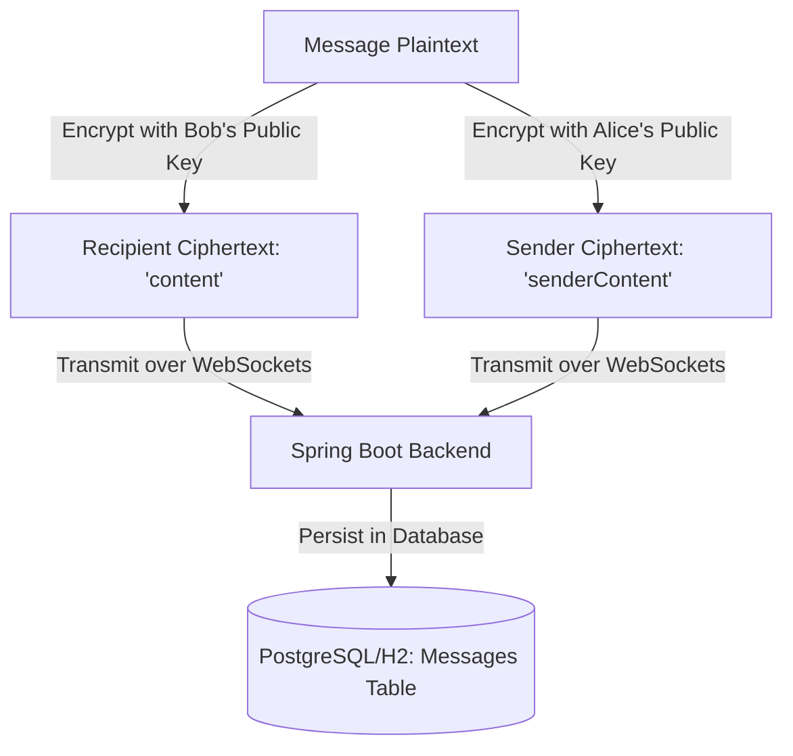

# ChatAppV2: End-to-End Encrypted Real-Time Messaging Platform

An enterprise-grade, secure, real-time messaging system featuring **End-to-End Encryption (E2EE)**, asymmetric cryptographic key exchanges, and real-time message broadcasting. The platform is architected with a decoupled **Android Native Client** and a robust **Spring Boot Java Backend**, utilizing **WebSockets with STOMP** and **Redis Pub/Sub** for multi-instance scalability.

---

## 1. System Architecture Overview

The system follows a classic **Client-Server Architecture**, but with a modern, secure, and decentralized cryptographic foundation:

```mermaid
graph TD
    subgraph Client Device (Android)
        A[Android App Client] <--> |Local Storage| B[(SharedPreferences: CryptoPrefs.xml)]
        A <--> |Crypto Engine| C[CryptoManager.java]
    end

    subgraph Transport Layer (Secure Channels)
        A <--> |HTTPS REST API / JSON| D[Spring Boot Backend]
        A <--> |WSS STOMP over WebSockets| D
    end

    subgraph Backend Services & Storage
        D <--> |Pub/Sub Messaging Bridge| E[(Redis Cache / Broker)]
        D <--> |JPA Persistence| F[(Relational Database)]
    end
```

### Components
1. **Android Client (`ChatApp`)**: A native Android mobile app utilizing Java, Retrofit for RESTful APIs, and a custom STOMP client for real-time WebSocket communication.
2. **Spring Boot Backend (`realtime-chat-backend`)**: A secure Spring Boot application exposing REST services, a WebSocket message broker (STOMP), and integrating Redis for event publishing and persistence.

---

## 2. End-to-End Encryption (E2EE) Deep Dive

The core security principle of **ChatAppV2** is that **messages are encrypted before they leave the sender's device and can only be decrypted by the intended recipient (or the sender themselves for history visualization)**. The backend server functions as a "blind" transport mediator, possessing no technical means to decrypt the payloads it persists.

### A. The Asymmetric Cryptographic Choice: RSA-2048
The application implements **RSA (Rivest–Shamir–Adleman) 2048-bit asymmetric encryption** combined with `RSA/ECB/PKCS1Padding` transformation. 

* **Why RSA?** Asymmetric cryptography allows secure transmission of secret information without requiring a pre-shared secret key.
* **Why 2048-bit?** It balances strong, production-grade security (deemed computationally secure against brute force for the foreseeable future) with rapid mobile processing speeds.
* **Why PKCS1Padding?** Prevents deterministic encryption attacks. Every encryption of the exact same plaintext produces a completely different ciphertext, protecting against patterns analysis.

### B. On-Device Key Generation & Secure Storage
Keys are generated directly on the mobile device during initial app setup within `CryptoManager.java`:

```java
KeyPairGenerator kpg = KeyPairGenerator.getInstance("RSA");
kpg.initialize(2048);
KeyPair kp = kpg.generateKeyPair();
PublicKey publicKey = kp.getPublic();
PrivateKey privateKey = kp.getPrivate();
```

* **Storage Location (Zero-Knowledge)**: 
  * The **Private Key** is serialized via Base64 (using `PKCS8EncodedKeySpec`) and stored locally in the application's private **`SharedPreferences`** (`CryptoPrefs.xml`).
  * **Crucial Rule**: The Private Key **never** leaves the physical device. It is never transmitted across the network or stored in any backend database.
  * The **Public Key** is serialized (using `X509EncodedKeySpec`) and uploaded to the server to establish friendships.

### C. The Friendship Public Key Exchange Protocol
For User A to message User B securely, User A must possess User B's public key. This is accomplished through an out-of-band **Public Key Directory Service** integrated directly into the friend request flow:

```mermaid
sequenceDiagram
    autonumber
    actor Alice as Alice (User A)
    participant Server as Spring Boot Server
    actor Bob as Bob (User B)

    Alice->>Server: 1. Send Friend Request (Alice's Public Key Attached)
    Note over Server: Server stores Alice's Public Key in FriendRequest (PENDING)
    Server-->>Bob: 2. Deliver Pending Request Notification
    Bob->>Server: 3. Accept Friend Request (Bob's Public Key Attached)
    Note over Server: Server stores Bob's Public Key; updates relation to ACCEPTED
    Alice->>Server: 4. Request Friend List (with Bob's public key)
    Server-->>Alice: Returns Friend List containing Bob's Public Key
    Bob->>Server: 5. Request Friend List (with Alice's public key)
    Server-->>Bob: Returns Friend List containing Alice's Public Key
```

Through this secure handshake:
* **`FriendRequest.java`** acts as the cryptographic registry, maintaining the public keys of the sender and recipient securely in columns `sender_public_key` and `recipient_public_key`.

### D. The Zero-Knowledge Dual Ciphertext Technique
When a user encrypts a message, the system faces an architectural challenge: *If only the recipient can decrypt the message, how can the sender view their own message history on a clean install or when retrieving messages from the server database?*

ChatAppV2 resolves this using a **Dual Ciphertext storage strategy**:



#### The Sending Process (`ChatActivity.java`):
1. **Encrypt for Recipient**: The plaintext is encrypted using the recipient's public key and set as `content`.
2. **Encrypt for Sender**: The same plaintext is encrypted using the sender's own public key and set as `senderContent`.
3. **Payload Construction**: The payload containing both encrypted texts is sent to the server.

```java
String encryptedForRecipient = cryptoManager.encrypt(plaintext, recipientPublicKey);
String encryptedForSender = cryptoManager.encrypt(plaintext, cryptoManager.getPublicKeyBase64());

ChatMessage message = new ChatMessage();
message.setContent(encryptedForRecipient);    // Bob will decrypt this
message.setSenderContent(encryptedForSender);  // Alice will decrypt this
```

#### The Retrieval Process (`ChatActivity.java`):
When fetching chat history:
* If the message was **sent by the current user**, they decrypt `senderContent` using their own Private Key.
* If the message was **received by the current user**, they decrypt `content` using their own Private Key.

```java
if (msg.getSenderId().equals(currentUserId)) {
    // Decrypt the sender's copy using my own private key
    String decrypted = cryptoManager.decrypt(msg.getSenderContent());
    msg.setContent(decrypted);
} else {
    // Decrypt the recipient's copy using my own private key
    String decrypted = cryptoManager.decrypt(msg.getContent());
    msg.setContent(decrypted);
}
```
**Security Outcome**: The server stores only the two ciphertexts. Since the server does not have Alice's or Bob's private keys, the messages remain **100% confidential**.

---

## 3. Internet Network Security Concepts

Beyond E2EE, the application employs multiple industry-standard security concepts to protect network traffic, data integrity, and authentication mechanisms.

### A. Transport Layer Security (TLS/HTTPS & WSS)
* All standard REST requests go through **HTTPS** (HTTP over TLS).
* Real-time communication utilizes secure **WebSockets (WSS)** rather than plain WS.
* **Mitigation**: This guards against **Man-in-the-Middle (MitM) Attacks**, packet sniffing, session hijacking, and ISP eavesdropping. Even if the message contents are already secured via E2EE, TLS protects metadata (usernames, endpoints, user statuses, and friend lists) from exposure.

### B. Safe Hashing: BCrypt Password Encryption
In the backend service (`UserService.java`), user passwords are never stored in plaintext. They are protected using **BCrypt**:

```java
User user = User.builder()
        .username(username)
        .password(passwordEncoder.encode(password)) // BCrypt hash
        .status(Status.OFFLINE)
        .build();
```

* **Salting**: BCrypt automatically applies a random salt to each password. This ensures that users with the identical password will have completely distinct hash signatures.
* **Work Factor**: BCrypt uses a configurable cost parameter (work factor) to slow down hashing operations.
* **Mitigation**: Protects against **Rainbow Table Attacks** (pre-computed hash databases) and makes **brute-force attacks** computationally expensive even if the database suffers a complete leak.

### C. Spring Security Architecture
The backend uses **Spring Security** configuration (`SecurityConfig.java`) to define and enforce access rules:

```java
@Bean
public SecurityFilterChain securityFilterChain(HttpSecurity http) throws Exception {
    http
        .csrf(AbstractHttpConfigurer::disable)
        .cors(cors -> cors.configurationSource(request -> {
            var corsConfiguration = new CorsConfiguration();
            corsConfiguration.setAllowedOriginPatterns(List.of("*"));
            corsConfiguration.setAllowedMethods(List.of("GET", "POST", "PUT", "DELETE", "OPTIONS"));
            corsConfiguration.setAllowedHeaders(List.of("*"));
            corsConfiguration.setAllowCredentials(true);
            return corsConfiguration;
        }))
        .authorizeHttpRequests(auth -> auth
            .requestMatchers("/api/auth/**").permitAll()
            .requestMatchers("/api/messages/**").permitAll()
            .requestMatchers("/api/friends/**").permitAll()
            .requestMatchers("/ws/**").permitAll()
            .anyRequest().authenticated()
        );
    return http.build();
}
```

* **CORS (Cross-Origin Resource Sharing)**: Prevents malicious websites from querying backend resources on behalf of a browser user. Configured cleanly to secure communications while remaining flexible for mobile IP shifts.
* **CSRF (Cross-Site Request Forgery) Protection**: Intentionally disabled because the client interacts via standard stateless RESTful API protocols and is not bound to stateful web browser cookie sessions.

### D. WebSocket Security and Real-Time Infrastructure
* **STOMP (Simple Text Oriented Messaging Protocol)**: Operates over the WebSocket layer, defining frame structures (CONNECT, SEND, SUBSCRIBE, MESSAGE) which standardizes routing.
* **Message Broker**: Spring's simple message broker publishes notifications directly to client-specific channels:
  * `/topic/messages/{userId}` (for real-time message delivery)
* **Redis Pub/Sub Bridging**: In a clustered environment, standard memory-based WebSockets are insufficient because client connections are distributed across multiple server instances. Redis Pub/Sub bridges these instances, broadcasting websocket events across the cluster to locate the instance where the recipient is active.

---

## 4. Key Limitations & Hardening Strategies

While the current implementation provides robust cryptographic privacy, production deployments typically introduce standard hardening mechanisms:

| Area | Current Implementation | Production Hardening Strategy |
| :--- | :--- | :--- |
| **Key Size & Algorithm Limits** | RSA-2048 limits payload sizes (max 245 bytes) | Implement **Hybrid Encryption**: Encrypt the message plaintext using AES-256 (symmetric, handles arbitrary size), then encrypt only the AES secret key using RSA-2048. |
| **Trust on First Use (TOFU)** | Public keys are downloaded directly from the server on demand. | Implement **Key Pinning** and **Signature Verification** to verify that public keys haven't been altered/replaced by a rogue server (MitM). |
| **Key Storage** | Stored in standard `SharedPreferences`. | Use the **Android Keystore System** to hardware-encrypt keys (using TEE - Trusted Execution Environment or StrongBox HSMs) to prevent access on rooted devices. |
| **Forward Secrecy** | Static long-term RSA keys are used for all messages. | Transition to **Double Ratchet Algorithm** (used by Signal/WhatsApp) to generate ephemeral session keys that change after every message, ensuring past logs remain safe even if a master key is compromised. |
